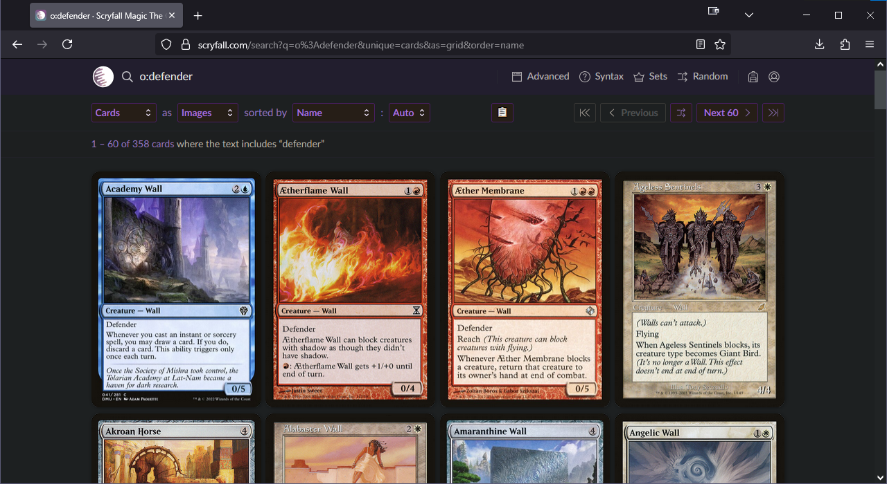
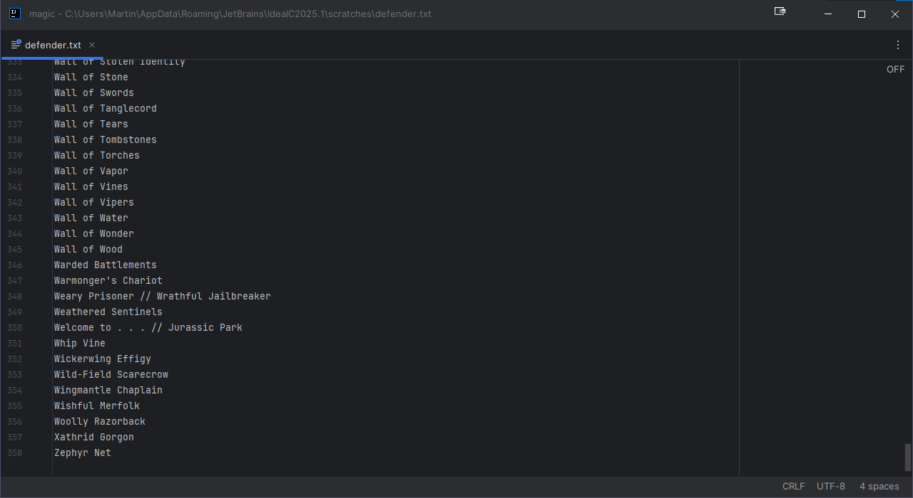
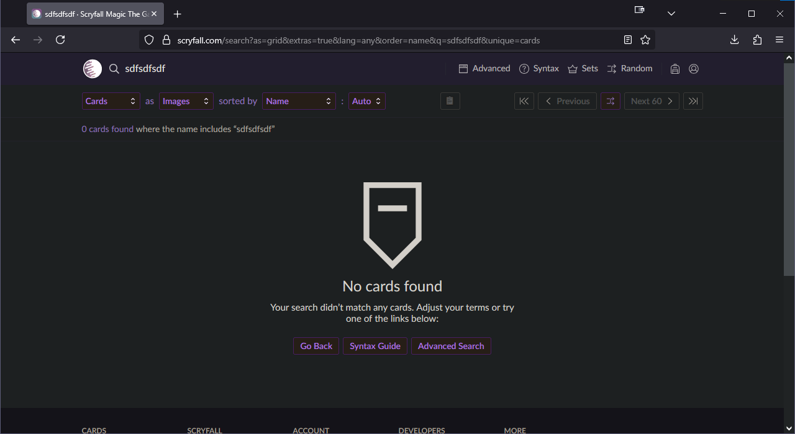

# Scryfall Enhancer

Scryfall Enhancer is a Firefox add-on that extends the functionality of [Scryfall](https://scryfall.com/), a card search tool for Magic: The Gathering.

## Features

- A **copy button** that lets you copy card search results straight to your clipboard.
- ...

## Screenshots

Searching for `o:defender` (cards that have the word "defender" in their text box) - the copy (📋) button is injected by **Scryfall Enhancer**:

The names of all 348 cards (not just the 60 shown on the first page) are copied to the clipboard:

If no cards are found, the copy button is disabled:

